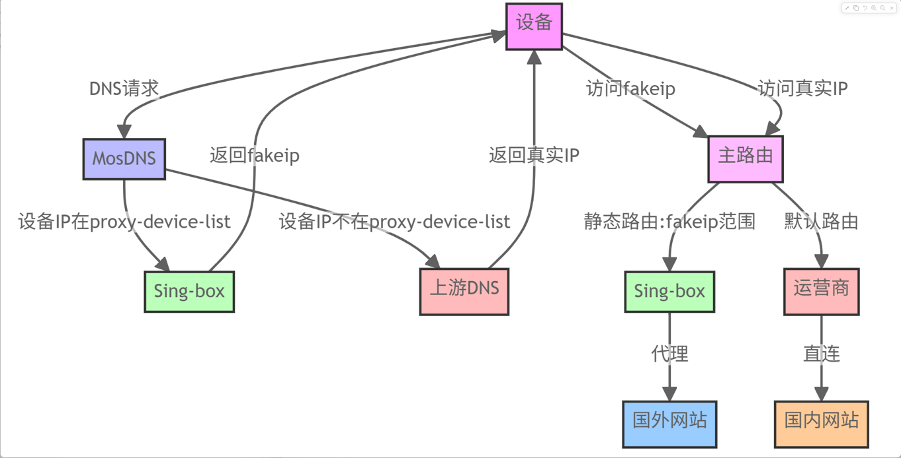
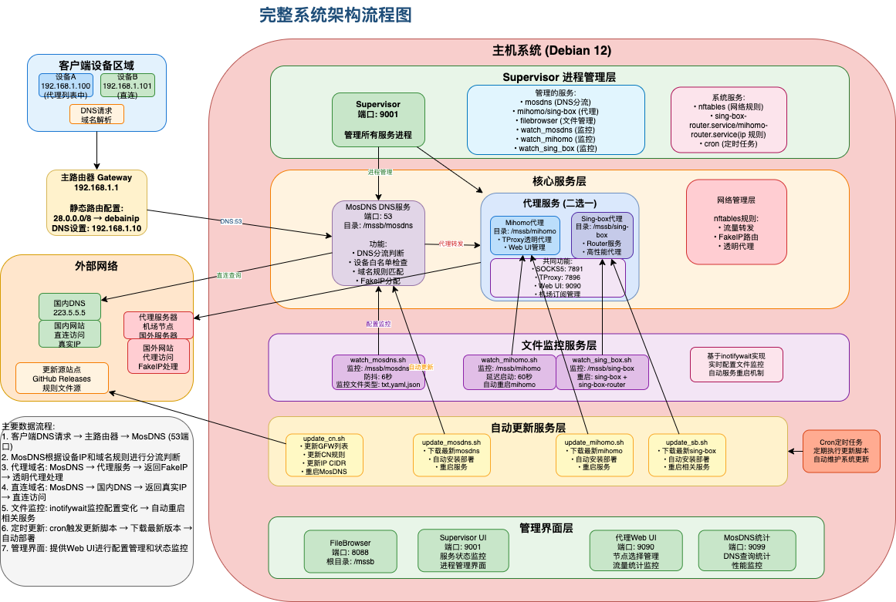

# Mosdns + Singbox/Mihomo 虚拟机分流代理项目（纯自用版本）

## 项目简介

> ⚠️ 本项目为自用版本，可能存在部分 bug，敬请见谅。
> 
### 主分支 Mosdns + Singbox/Mihomo https://github.com/baozaodetudou/mssb
### 次分支 adguard + Mosdns + Singbox/Mihomo https://github.com/baozaodetudou/mssb/tree/ami

封装 `mosdns` 和 `singbox/mihomo` 两个服务，旨在实现高效的分流代理功能。

* `mosdns` 使用 53 端口对外提供 DNS 服务；
* `singbox/mihomo` 使用 6666 端口与 `mosdns` 对接，代理转发使用统一的 TProxy 高效端口 7896；
* 出国访问通过 `mosdns` 转发到 `singbox/mihomo`，并启用 `fakeip` 模式（使用网段 28.0.0.0/8），需在主路由上添加相应静态路由；
* 文档参考：[fakeip.md](docs/fakeip.md)

项目同时整合：

* `filebrowser`：用于配置文件的可视化管理；
* `zashboard`：`singbox/mihomo` 的 Web UI 界面。

感谢各位大佬的贡献，特别是 PH 和 hero 两位大佬的支持。
大概流程如下，感谢群友提供


## 项目功能

* ✅ **进程管理**：通过 `supervisor` 管理服务进程
* ✅ **高效分流代理**：`mosdns` + `singbox/mihomo` 分流代理架构
* ✅ **可视化管理**：使用 `filebrowser` 管理配置文件
* ✅ **前端界面**：通过 `zashboard` 提供友好的配置界面

## 架构图


```plaintext
+------------------+           +----------------------+
|     filebrowser  |           |       zashboard      |
+------------------+           +----------------------+
           |                               |
+------------------+           +----------------------+
|      mosdns      | --------> |    singbox/mihomo    |
+------------------+           +----------------------+
```

### 服务端口分配

| 服务                 | 端口   | 描述                  |
| ------------------ | ---- | ------------------- |
| filebrowser        | 8088 | 文件管理界面              |
| supervisor         | 9001 | 进程管理界面              |
| mosdns             | 53   | DNS 服务入口            |
| singbox DNS 接口     | 6666 | 与 mosdns 对接端口       |
| socks5代理           | 7891 | singbox SOCKS5 代理端口 |
| TProxy透明代理         | 7896 | 高效透明代理端口            |
| Web UI (zashboard) | 9090 | singbox Web 界面      |

## 安装方法

### 适用于 Debian 12 系统：

```bash
# 若主机无代理，可通过导出局域网代理环境变量临时加速安装
# 示例：使用 Mac 上的 surge 或 Windows 上的 mihomo 开启局域网代理
export https_proxy=http://192.168.12.239:6152
export http_proxy=http://192.168.12.239:6152
export all_proxy=socks5://192.168.12.239:6153

# 拉取仓库并安装（包含安装、卸载、启动、停止功能）
git clone --depth=1 https://github.com/baozaodetudou/mssb.git && cd mssb && bash install.sh
```

### 开发分支(不稳定慎用)
```bash
# 若主机无代理，可通过导出局域网代理环境变量临时加速安装
# 示例：使用 Mac 上的 surge 或 Windows 上的 mihomo 开启局域网代理
export https_proxy=http://192.168.12.239:6152
export http_proxy=http://192.168.12.239:6152
export all_proxy=socks5://192.168.12.239:6153

# 拉取仓库并安装（包含安装、卸载、启动、停止功能）
git clone https://github.com/baozaodetudou/mssb.git && cd mssb && git checkout dev && bash install.sh
```

## 查看日志

查看所有服务日志：

```bash
tail -f /var/log/supervisor/*.log
```

## 附注信息

### 1. filebrowser

* 端口：8088
* 默认用户：`admin`
* 默认密码：`admin`
* 有些人不想要登录可以执行下边的命令
  ```shell
  # 取消用户密码登录登录功能
  supervisorctl stop filebrowser && filebrowser config set --auth.method=noauth -c /mssb/fb/fb.json -d /mssb/fb/fb.db && supervisorctl start filebrowser
  # 恢复用户密码登录登录功能
  supervisorctl stop filebrowser && filebrowser config set --auth.method=json -c /mssb/fb/fb.json -d /mssb/fb/fb.db && supervisorctl start filebrowser
  ```

### 2. supervisor

* 端口：9001
* 默认用户：`mssb`
* 默认密码：`mssb123..`

### 3. mosdns 统计页面

* 地址：http\://{主机IP}:9099/graphic

### 4. 功能说明

* `mosdns`：提供 DNS 解析与缓存加速；
* `singbox`：提供 SOCKS5 和透明代理；
* `zashboard`：配置前端界面，状态显示。

### 5. 使用方法

* 安装完成后，将主路由的 DNS 设置为 Debian 主机的 IP；
* mosdns可以选择是否启用指定client科学开关(默认启用)
  * 配置文件在`/mssb/mosdns/sub_config/switch.yaml`中 switch2 'A'-启用  'B'-不启用
  * UI界面也可修改但是目前重启后会失效被yaml配置文件覆盖
  * 不启用的话全部设备都会走科学
  * 启用只有`client_ip.txt`文件里的内网设备走科学
    * 设备分流控制：将需要走代理的设备 IP 添加到 `client_ip.txt` 文件中，路径为：
      ```text
      /mssb/mosdns/client_ip.txt
      ```
    * 文件中未列出的 IP 只使用 mosdns 加速，不通过代理。
* 由于mosdns存在缓存针对一下ddns域名需要加进 mywhitelist.txt 不然由于ip更新缓存不更新会导致访问失败
  ```text
  /mssb/mosdns/mywhitelist.txt
  ```
---
* 是否启用屏蔽无解析结果的A、AAAA请求及黑名单  'A'-启用  'B'-不启用
  * 配置文件在`/mssb/mosdns/sub_config/switch.yaml`中 switch1
  * UI界面也可修改但是目前重启后会失效被yaml配置文件覆盖
* 泄露版本/不泄露版本开关 'A'-泄露  'B'-不泄露
  * 配置文件在`/mssb/mosdns/sub_config/switch.yaml`中 switch3
  * UI界面也可修改但是目前重启后会失效被yaml配置文件覆盖

* PH佬在界面加了软启动，我这个项目会监听配置文件进行硬启动
* 所以没啥特殊情况还是建议改配置文件稳妥UI只负责显示

### 项目来源和参考

* [https://github.com/herozmy/StoreHouse/tree/latest](https://github.com/herozmy/StoreHouse/tree/latest)
* 感谢英雄佬的脚本教程
* 感谢 Phil Horse大佬的 mosdns的优化摸噶
* 感谢 Jimmy Dada 大佬提供mosdns前端页面
* 感谢 mosdns/singbox/mihomo的各位开发大佬们

感谢所有提供支持与灵感的开源作者！
